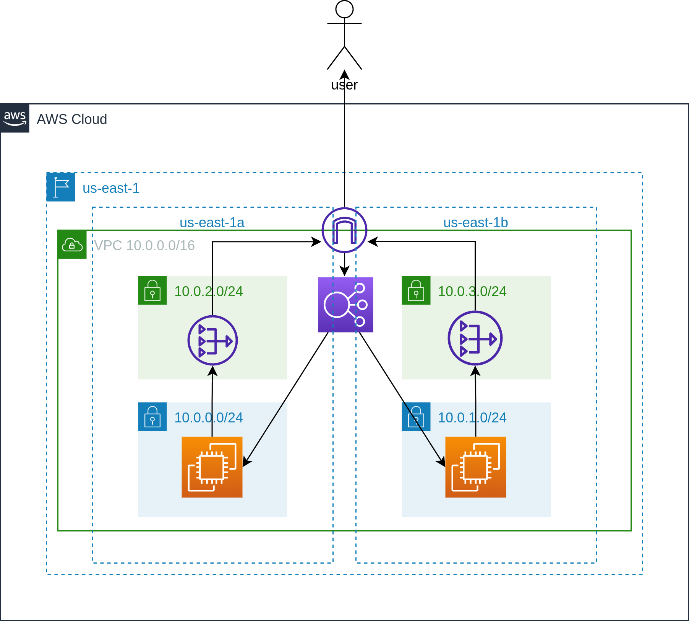

# Infraestructura como código

### Trabajo Práctico Especial - Redes de Información

Autores:

- Agustín Tormakh
- Francisco Quesada
- Camila Borinsky

## Requisitos

- [Git](https://git-scm.com/book/en/v2/Getting-Started-Installing-Git)
- [Terraform](https://www.terraform.io/downloads.html)
- [Pulumi](https://www.pulumi.com/docs/get-started/install/)

## Clonar repositorio

Para clonar el repositorio
utilizando ssh ejecutar:

```
git clone git@github.com:camilaborinsky/redes-iac.git
```

utilizando https ejecutar:

```
git clone https://github.com/camilaborinsky/redes-iac.git
```

o descargar `.zip` desde [github](https://github.com/camilaborinsky/redes-iac)

## Obtener credenciales

Para poder levantar la red en AWS, se deben obtener las credenciales de AWS. Para esto, se debe crear un usuario en AWS con permisos de administrador y obtener las credenciales de este usuario. Estas credenciales se deben guardar en el archivo `terraform/.env` con el siguiente formato:

```
AWS_ACCESS_KEY_ID=
AWS_SECRET_ACCESS_KEY=
AWS_SESSION_TOKEN=
```

## Instrucciones

El codigo se encuentra estructurado de esta manera:

```
.
├── express-api
│    ├── src
│    │   └── app.js
│    ├── package.json
│    └── package-lock.json
├── front-react
│     ├── src
│     │   └── app.js
│     ├── package.json
│     └── package-lock.json
├── scripts
│     ├── network.sh
│     └── plan_network.sh
├── pulumi
│   └── gcp
│       ├── cloudfunction
│       │   ├── index.js
│       │   ├── package.json
│       │   └── tsconfig.json
│       ├── main.ts
│       └── pulumi.yaml
│
└── terraform
    ├── modules
    │  └── ...
    │    ├── main.tf
    │    ├── outputs.tf
    │    └── variables.tf
    ├─ main.tf
    ├─ locals.tf
    ├─ providers.tf
    ├─ terraform.tfvars
    ├─ versions.tf
    └─ variables.tf

```

La carpeta `express-api` contiene el código de la api en express, la carpeta `front-react` contiene el código del front en react, la carpeta `scripts` contiene los scripts para ejecutar los comandos de terraform y pulumi, la carpeta `pulumi` contiene el código de pulumi para GCP y la carpeta `terraform` contiene el código de terraform para AWS.

Dentro de la carpeta `terraform` se encuentra el archivo `terraform.tfvars` donde se deben definir las variables de terraform. Las variables que se deben definir son las siguientes:

```
domain_name  = "dominio a utilizar"
vpc_cidr     = "cidr de la vpc"
vpc_name     = "nombre de la vpc"
ec2_api_port = puerto de la api

```

Dentro de la carpeta modules se encuentra el código de los módulos de terraform. Los módulos fueron creados para poder reutilizar el código y que sea más fácil de mantener. A su vez permite crear multiples recursos con la misma configuración sin necesidad de repetir el código. Cada módulo posee un archivo `main.tf` donde se define el recurso, un archivo `outputs.tf` donde se definen las salidas del módulo y un archivo `variables.tf` donde se definen las variables del módulo (aka inputs).

## Modulos

En la carpeta `modules` se encuentran distintos modulos que implementamos para lograr una configuracion consistente y repetible de los recursos mas comunes que creamos. Los mismos permiten que con el solo completado de algunas variables se cree todo un recurso o un grupo de recursos especifico. En ella encontramos los modulos de:

- cloudfront
- ec2
- internet_gateway
- nat_gateway
- s3
- subnet
- vpc

## Arquitectura

La arquitectura de la red es la siguiente:

## Levantar una red en AWS

Para levantar la red en AWS, se debe ejecutar el script `network.sh` ubicado en la carpeta `scripts`. Este script se encarga de ejecutar los comandos necesarios para levantar la red en AWS utilizando `terraform`.

```
cd scripts
./network.sh
```

Esto despliega una red en AWS con los siguientes recursos:

- 1 VPC
- 4 Subnets (2 públicas y 2 privadas)
- 1 Internet Gateway
- 2 NAT Gateways
- 4 Route Tables (2 públicas y 2 privadas)
-
- 1 Application Load Balancer


